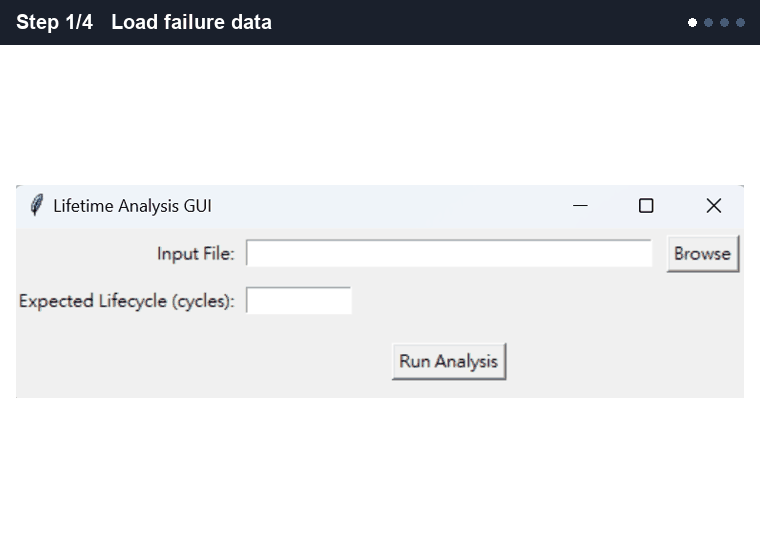

<div align="center">

# Test2Fail Toolkit

Takes test-to-failure data and returns a reliability report. It fits life distributions, estimates B10/B50/MTTF and writes a PDF.

[Download for Windows / macOS](https://github.com/liu092111/Test2Fail-Toolkit/releases/latest) · [Sample report](sample_report.pdf)



</div>

<details open>
<summary><b>English</b></summary>

## What it does

- Fits Weibull, Lognormal and Exponential distributions by MLE and picks the best one
- Puts 95% bootstrap confidence intervals (1,000 resamples) on the Weibull β and η
- Predicts B10, B50, B95 and MTTF from a 10,000-sample Monte Carlo simulation
- Validates the fit with a Kolmogorov–Smirnov test
- Recommends a maintenance interval based on target reliability and cost
- Writes a one-click PDF report with every plot and table


## Quick start

```bash
pip install -r requirements.txt
python main.py
```

Select a data file (samples are in `dataset/`), enter the expected lifecycle and click **Run Analysis**.

<details>
<summary>Use it from Python</summary>

```python
from function_code import LifetimeAnalyzer, LifetimeAnalyzerMC

analyzer = LifetimeAnalyzer("dataset/dataset-1.csv")
analyzer.fit_distributions()

mc = LifetimeAnalyzerMC(analyzer.data)
mc.print_bootstrap_weibull_params()
mc.print_monte_carlo_lifetime()

analyzer.calculate_maintenance_recommendations(
    target_reliability=0.9, cost_per_maintenance=1000, cost_per_failure=10000
)
```
</details>

<details>
<summary>Reading the Weibull parameters</summary>

| β | Failure pattern |
|---|---|
| < 1 | Infant mortality: the failure rate decreases |
| ≈ 1 | Random: the failure rate is constant |
| > 1 | Wear-out: the failure rate increases |

η is the characteristic life, the point where 63.2% of units have failed.
</details>

## Project structure

| File | Role |
|---|---|
| `main.py` | Entry point |
| `gui.py` | Tkinter interface |
| `function_code.py` | Fitting, bootstrap, Monte Carlo, plots |
| `report_builder.py` | PDF report |
| `.github/workflows/build.yml` | Builds executables on `v*` tags |

</details>

<details>
<summary><b>繁體中文</b></summary>

輸入 test-to-failure 資料，產出可靠度報告。它會擬合壽命分布、估算 B10/B50/MTTF，並輸出 PDF。

[下載 Windows / macOS 版](https://github.com/liu092111/Test2Fail-Toolkit/releases/latest) · [範例報告](sample_report.pdf)

## 功能

- 以 MLE 擬合 Weibull、Lognormal、Exponential 三種分布，並自動選出最佳分布
- 以 bootstrap（1,000 次重抽樣）估算 Weibull β、η 的 95% 信賴區間
- 以 10,000 筆 Monte Carlo 模擬預測 B10、B50、B95 和 MTTF
- 以 Kolmogorov–Smirnov 檢定驗證擬合結果
- 依目標可靠度與成本，建議保養週期
- 一鍵輸出 PDF 報告，內含所有圖表


## 快速開始

```bash
pip install -r requirements.txt
python main.py
```

選擇資料檔（範例在 `dataset/`），輸入預期壽命，再按 **Run Analysis**。

<details>
<summary>從 Python 呼叫</summary>

```python
from function_code import LifetimeAnalyzer, LifetimeAnalyzerMC

analyzer = LifetimeAnalyzer("dataset/dataset-1.csv")
analyzer.fit_distributions()

mc = LifetimeAnalyzerMC(analyzer.data)
mc.print_bootstrap_weibull_params()
mc.print_monte_carlo_lifetime()

analyzer.calculate_maintenance_recommendations(
    target_reliability=0.9, cost_per_maintenance=1000, cost_per_failure=10000
)
```
</details>

<details>
<summary>如何解讀 Weibull 參數</summary>

| β | 失效型態 |
|---|---|
| < 1 | 早夭期：失效率遞減 |
| ≈ 1 | 隨機失效：失效率固定 |
| > 1 | 磨耗期：失效率遞增 |

η 是特徵壽命，也就是 63.2% 的樣品失效的時間點。
</details>

## 專案結構

| 檔案 | 用途 |
|---|---|
| `main.py` | 程式進入點 |
| `gui.py` | Tkinter 介面 |
| `function_code.py` | 擬合、bootstrap、Monte Carlo、繪圖 |
| `report_builder.py` | PDF 報告 |
| `.github/workflows/build.yml` | 推送 `v*` tag 時自動建置執行檔 |

</details>
